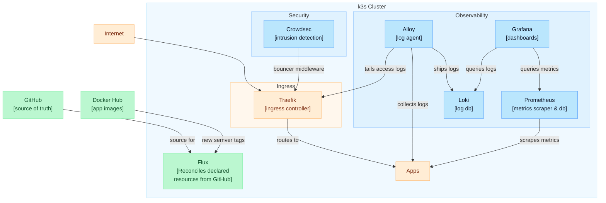

# Dockmaster

GitOps-managed k3s cluster for self-hosted applications.

## Architecture



## Structure

```
clusters/production/       Flux Kustomizations (image automation + infrastructure → observability → apps)
clusters/production/image-automation/ Flux image repositories, policies, and update automation
infrastructure/            Namespaces, Traefik config (HelmChartConfig), middlewares, Crowdsec, Headlamp
observability/             Prometheus stack, Loki, Alloy, Grafana dashboards
apps/                      Application deployments (function-plotter, lab-home, wordle-duel, wordle-duel-service, redis)
scripts/                   Bootstrap and operational scripts
doc/                       Setup and operations guides
secrets/                   Secret templates (real values git-ignored)
docs/                      Deep-dive documentation (secrets inventory, Crowdsec, TLS, rollback)
```

## Stack

| Component                                                                    | Purpose                                                | Chart version |
|------------------------------------------------------------------------------|--------------------------------------------------------|---------------|
| [Flux](https://fluxcd.io/)                                                   | GitOps continuous delivery + image automation          | v2            |
| [Traefik](https://traefik.io/)                                               | Ingress controller (bundled with k3s)                  | k3s-managed   |
| [kube-prometheus-stack](https://github.com/prometheus-community/helm-charts) | Prometheus, Grafana, node-exporter, kube-state-metrics | 87.12.5       |
| [Loki](https://grafana.com/oss/loki/)                                        | Log aggregation (SingleBinary, TSDB, 30d retention)    | 7.0.0         |
| [Alloy](https://grafana.com/oss/alloy/)                                      | Log collection (pod logs + Traefik access logs)        | 1.10.0        |
| [Crowdsec](https://www.crowdsec.net/)                                        | Intrusion detection + Traefik bouncer                  | 0.22.1        |
| [Headlamp](https://headlamp.dev/)                                            | Cluster web UI (token auth)                            | 0.43.0        |

## Applications

| App                 | Description              | URL                                      |
|---------------------|--------------------------|------------------------------------------|
| function-plotter    | Function plotting app    | `https://dariolab.com/function-plotter/` |
| lab-home            | Static landing page      | `https://dariolab.com/`                  |
| wordle-duel         | Wordle game frontend     | `https://dariolab.com/wordle-duel/`      |
| wordle-duel-service | Spring Boot API backend  | `https://dariolab.com/wordle-duel/api/`  |
| Grafana             | Observability dashboards | `https://dariolab.com/grafana/`          |
| Headlamp            | Cluster management UI    | `https://dariolab.com/dashboard`         |

App deployments under `apps/` are version-pinned in git and automatically bumped by Flux when a
new stable semver tag is published to Docker Hub for the tracked first-party images.

## Prerequisites

- `DNS A` record for your domain pointing to VPS IP
- GitHub Personal Access Token with write repo permissions for flux
- Ubuntu/Debian VPS with `sudo` access for the first server

## Guides

- [Getting started and node join](doc/getting-started.md)
- [Operations](doc/operations.md)
- [Secrets inventory](docs/secrets-inventory.md)
- [Crowdsec operations](docs/crowdsec.md)
