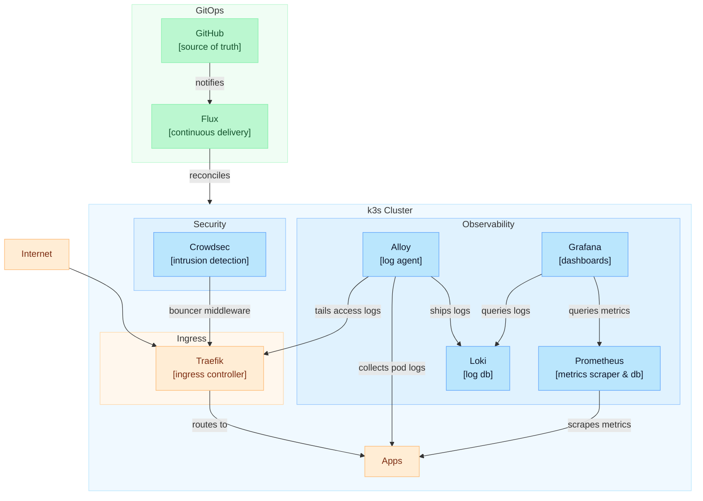

# Dockmaster

GitOps-managed k3s cluster for self-hosted applications.

## Architecture



## Structure

```
clusters/production/       Flux Kustomizations (infrastructure → observability → apps)
infrastructure/            Namespaces, Traefik config (HelmChartConfig), middlewares, Crowdsec, Headlamp
observability/             Prometheus stack, Loki, Alloy, Grafana dashboards
apps/                      Application deployments (lab-home, wordle-duel, wordle-duel-service, redis)
scripts/                   Bootstrap and operational scripts
secrets/                   Secret templates (real values git-ignored)
docs/                      Documentation (secrets inventory, Crowdsec operations)
```

## Stack

| Component                                                                    | Purpose                                                | Chart version |
|------------------------------------------------------------------------------|--------------------------------------------------------|---------------|
| [Flux](https://fluxcd.io/)                                                   | GitOps continuous delivery                             | v2            |
| [Traefik](https://traefik.io/)                                               | Ingress controller (bundled with k3s)                  | k3s-managed   |
| [kube-prometheus-stack](https://github.com/prometheus-community/helm-charts) | Prometheus, Grafana, node-exporter, kube-state-metrics | 72.9.1        |
| [Loki](https://grafana.com/oss/loki/)                                        | Log aggregation (SingleBinary, TSDB, 30d retention)    | 6.53.0        |
| [Alloy](https://grafana.com/oss/alloy/)                                      | Log collection (pod logs + Traefik access logs)        | 0.12.6        |
| [Crowdsec](https://www.crowdsec.net/)                                        | Intrusion detection + Traefik bouncer                  | 0.22.1        |
| [Headlamp](https://headlamp.dev/)                                            | Cluster web UI (token auth)                            | 0.40.0        |

## Applications

| App                 | Description              | URL                                     |
|---------------------|--------------------------|-----------------------------------------|
| lab-home            | Static landing page      | `https://dariolab.com/`                 |
| wordle-duel         | Wordle game frontend     | `https://dariolab.com/wordle-duel/`     |
| wordle-duel-service | Spring Boot API backend  | `https://dariolab.com/wordle-duel/api/` |
| Grafana             | Observability dashboards | `https://dariolab.com/grafana/`         |
| Headlamp            | Cluster management UI    | `https://dariolab.com/dashboard`        |

## Prerequisites

- VPS with ports 80 and 443 open
- DNS A record for `dariolab.com` pointing to VPS IP
- GitHub Personal Access Token with repo permissions for flux

## Quick Start

1. **Clone the repo on the VPS:**
   ```bash
   git clone https://github.com/dario-mr/dockmaster.git
   cd dockmaster
   ```

2. **Prepare secrets:**
   ```bash
   cp secrets/wordle-duel-service-secrets.template.yaml secrets/wordle-duel-service-secrets.yaml
   cp secrets/observability-secrets.template.yaml secrets/observability-secrets.yaml
   cp secrets/crowdsec-secrets.template.yaml secrets/crowdsec-secrets.yaml
   cp secrets/geoipupdate-secret.template.yaml secrets/geoipupdate-secret.yaml
   # Edit secrets with real values
   ```

3. **Run bootstrap:**
   ```bash
   export GITHUB_TOKEN=ghp_your_token_here
   sudo -E bash scripts/bootstrap.sh
   ```

4. **Apply secrets:**
   ```bash
   sudo bash scripts/apply-secrets.sh
   ```

5. **Verify:**
   ```bash
   flux get kustomizations
   kubectl get pods -A
   ```

See [docs/secrets-inventory.md](docs/secrets-inventory.md) for all required secret values.
See [docs/crowdsec.md](docs/crowdsec.md) for Crowdsec operations and troubleshooting.

## Operations

```bash
# Check Flux reconciliation status
flux get kustomizations

# Force reconcile a layer
flux reconcile kustomization infrastructure
flux reconcile kustomization observability
flux reconcile kustomization apps

# Restart a workload after ConfigMap changes
kubectl rollout restart daemonset/alloy -n observability

# Check Helm release versions
flux get helmreleases -n observability

# View logs
kubectl logs -n observability -l app.kubernetes.io/name=alloy -c alloy --tail=20
kubectl logs -n observability -l app.kubernetes.io/name=grafana -c grafana --tail=20
```
