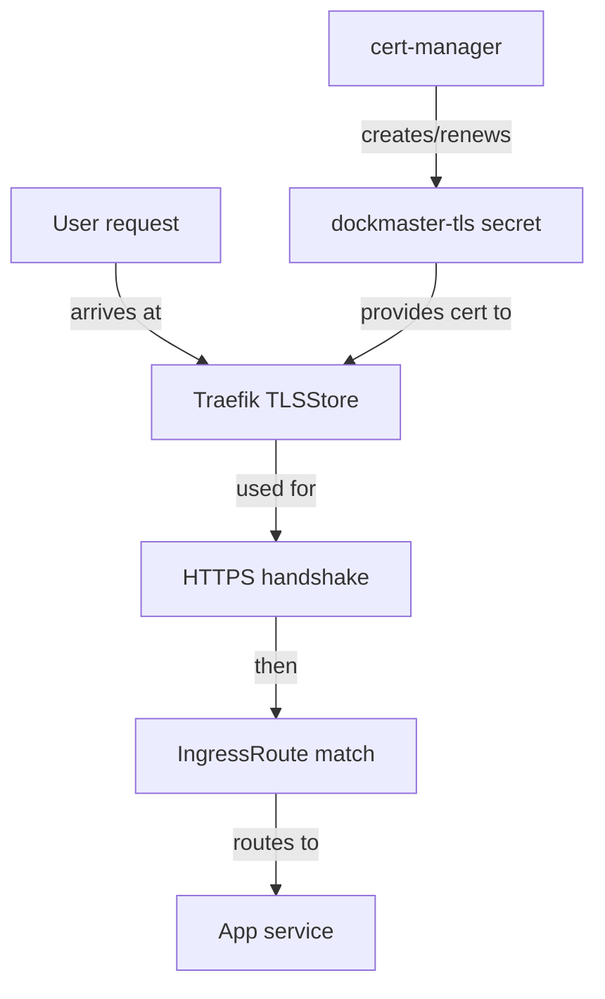

# TLS termination

This is the runtime TLS flow for requests coming into the cluster.

## Request flow

When a user opens `https://dariolab.com/...`, the request reaches Traefik. Traefik checks its
default `TLSStore`, finds the `dockmaster-tls` secret, and uses that certificate for the HTTPS
handshake. After that, Traefik routes the request to the matching app based on the path.

`cert-manager` stays in the background and keeps the `dockmaster-tls` secret populated with a valid
certificate.

## Diagram

## Why this setup is useful

- apps do not each need their own certificate config
- certificates are stored in Kubernetes instead of node-local files
- renewals are automatic
- Traefik can serve the same certificate to all path-based apps on the same domain
